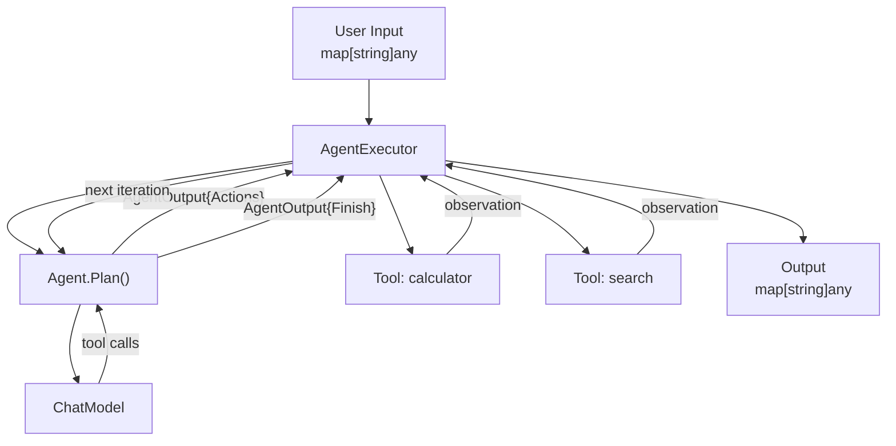
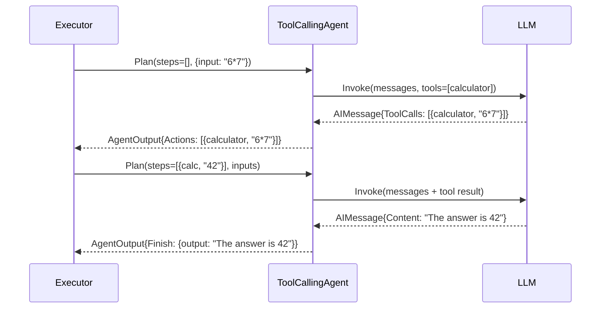
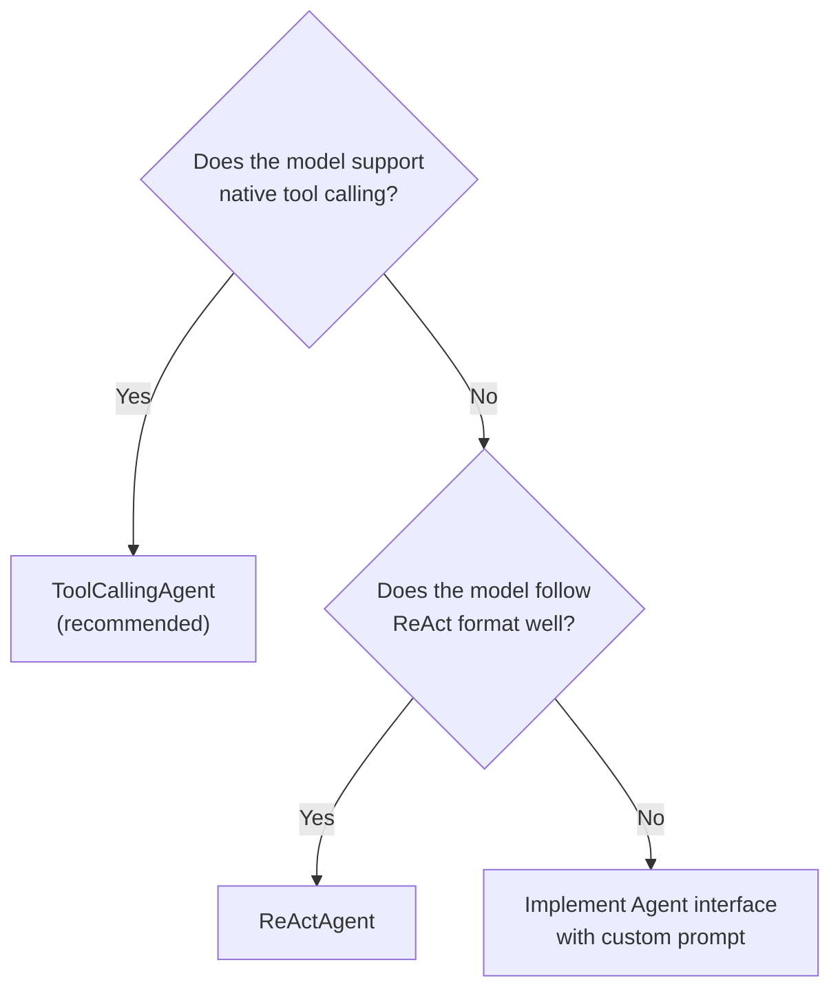

# Agents

Agents use language models to decide which actions to take. Unlike chains (which follow a fixed pipeline), agents can loop, branch, and call tools dynamically in response to the model's output.

---

## Concepts



### Key types

| Type | Description |
|---|---|
| `Agent` | Planning interface: given history, decide what to do next |
| `AgentAction` | A tool the agent wants to call, with its input |
| `AgentFinish` | Final answer from the agent |
| `AgentStep` | A completed action + its observation (tool result) |
| `AgentOutput` | Union: either `[]AgentAction` (continue) or `*AgentFinish` (done) |
| `AgentExecutor` | Runs the `Plan → Execute → Observe` loop |

```go
// agents/types.go
type AgentAction struct {
    Tool      string         // tool name
    ToolInput string         // JSON input string
    Log       string         // why this action was chosen
    MessageLog []core.Message
}

type AgentFinish struct {
    ReturnValues map[string]any
    Log          string
    MessageLog   []core.Message
}

type AgentStep struct {
    Action      AgentAction
    Observation string // result of executing the tool
}

type AgentOutput struct {
    Actions []AgentAction // non-nil if more steps needed
    Finish  *AgentFinish  // non-nil if done
}
```

---

## `Agent` Interface

```go
type Agent interface {
    Plan(ctx context.Context, intermediateSteps []AgentStep, inputs map[string]any) (*AgentOutput, error)
    InputKeys() []string
    OutputKeys() []string
}
```

The `AgentExecutor` calls `Plan` in every iteration, passing the accumulated intermediate steps. The agent returns either more actions to take, or a finish signal.

---

## `ToolCallingAgent` — recommended

`ToolCallingAgent` uses the model's native function/tool calling capability. It is the modern, recommended agent type that works with all major providers.



### Setup

```go
import (
    "github.com/LucaLanziani/langchain-go/agents"
    "github.com/LucaLanziani/langchain-go/prompts"
    "github.com/LucaLanziani/langchain-go/providers/openai"
    "github.com/LucaLanziani/langchain-go/tools"
)

calc := tools.NewTool("calculator", "Evaluate a math expression.",
    func(_ context.Context, input string) (string, error) {
        // parse input JSON {"input": "6*7"} and evaluate
        return "42", nil
    },
)

prompt := prompts.NewChatPromptTemplate(
    prompts.System("You are a helpful assistant. Use tools when needed."),
    prompts.Placeholder("agent_scratchpad"), // REQUIRED: intermediate steps
    prompts.Human("{input}"),
)

agent := agents.NewToolCallingAgent(openai.New(), []tools.Tool{calc}, prompt)
exec  := agents.NewAgentExecutor(agent, []tools.Tool{calc})

result, err := exec.Invoke(ctx, map[string]any{"input": "What is 6 times 7?"})
fmt.Println(result["output"]) // "The answer is 42"
```

> **Important:** The prompt must include `prompts.Placeholder("agent_scratchpad")`. This is where the executor injects the history of `AIMessage + ToolMessage` pairs that represent the tool-calling conversation.

---

## `ReActAgent` — text-based reasoning

`ReActAgent` implements the [ReAct (Reasoning + Acting)](https://arxiv.org/abs/2210.03629) prompting pattern. It generates text in a structured `Thought / Action / Action Input / Observation / Final Answer` format. It works with models that do not support native tool calling.

### Default prompt format

```
Thought: I need to calculate 6 * 7.
Action: calculator
Action Input: {"input": "6 * 7"}
Observation: 42
Thought: I now know the final answer.
Final Answer: The answer is 42.
```

### Setup

```go
agent := agents.NewReActAgent(openai.New(), []tools.Tool{calc}, nil) // nil = use default prompt
exec  := agents.NewAgentExecutor(agent, []tools.Tool{calc})

result, err := exec.Invoke(ctx, map[string]any{"input": "What is 6 * 7?"})
```

### Custom prompt

```go
customPrompt := agents.DefaultReActPrompt() // start from default, then modify
agent := agents.NewReActAgent(model, agentTools, customPrompt)
```

The default ReAct prompt expects `{tools}`, `{tool_names}`, `{agent_scratchpad}`, and `{input}` variables. The agent fills all of these automatically.

---

## `AgentExecutor`

`AgentExecutor` implements `Runnable[map[string]any, map[string]any]` and runs the agent loop.

### Constructor

```go
exec := agents.NewAgentExecutor(agent, agentTools,
    agents.WithMaxIterations(20),
    agents.WithReturnIntermediateSteps(true),
    agents.WithHandleParsingErrors(true),
)
```

### Options

| Option | Default | Description |
|---|---|---|
| `WithMaxIterations(n)` | `15` | Stop after this many plan→execute cycles to prevent infinite loops |
| `WithReturnIntermediateSteps(v)` | `false` | Include `intermediate_steps` key in the output map |
| `WithHandleParsingErrors(v)` | `false` | On parsing error, send the error back to the model as an observation instead of returning an error |

### Output

`Invoke` returns a `map[string]any` with at minimum:

```go
{
    "output": "The final answer string",
    // if WithReturnIntermediateSteps(true):
    "intermediate_steps": []agents.AgentStep{ ... },
}
```

### Tool lookup

The executor looks up tools by name in its internal `toolMap`. If the agent requests a tool that is not in the map, the executor returns an error observation (tool not found) and continues the loop rather than aborting.

---

## Streaming

`AgentExecutor` supports streaming intermediate events:

```go
stream, err := exec.Stream(ctx, map[string]any{"input": "..."})
for {
    chunk, ok, err := stream.Next()
    if !ok || err != nil { break }
    // chunk is *core.AIMessage containing partial content or tool call info
    fmt.Print(chunk.Content)
}
```

---

## Choosing Between Agents



Use `ToolCallingAgent` whenever possible. It is more reliable because tool invocations are structured data rather than parsed text.
