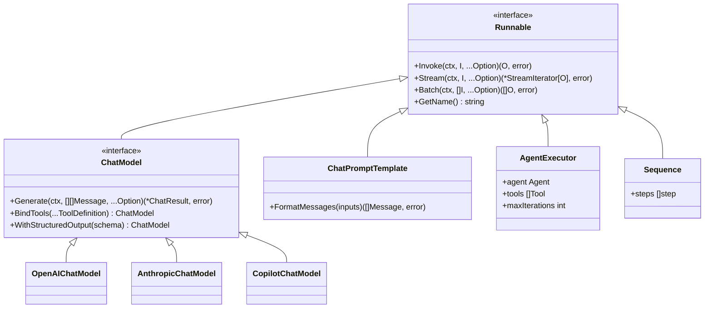
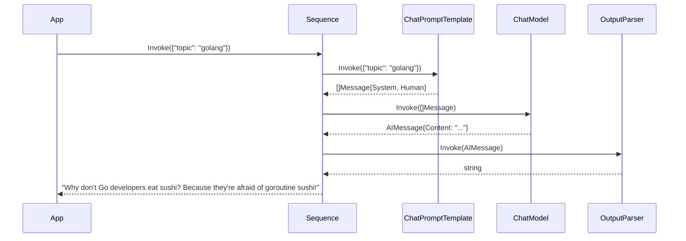
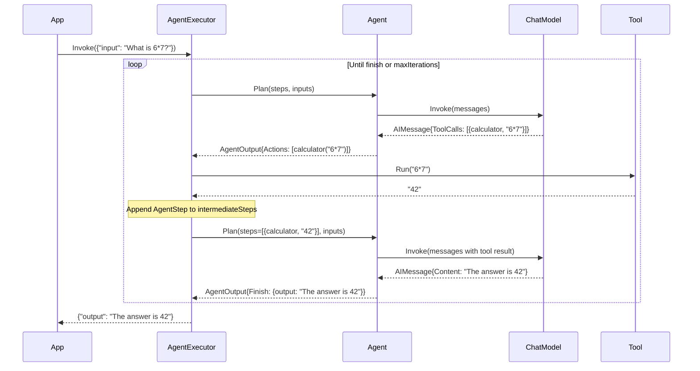
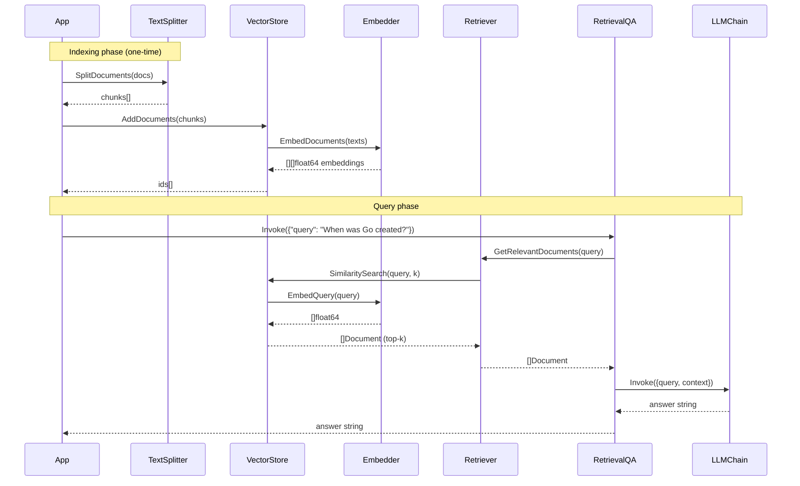
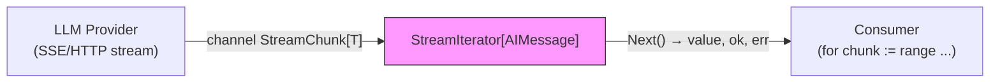

# Architecture

This document describes the high-level architecture of langchain-go, its component model, and the key data flows.

---

## Component Overview

```mermaid
graph TB
    subgraph "Application Layer"
        App["Your Application"]
    end

    subgraph "Agent Layer"
        Executor["AgentExecutor"]
        ReAct["ReActAgent"]
        ToolCalling["ToolCallingAgent"]
    end

    subgraph "Chain Layer"
        LLMChain["LLMChain"]
        StuffDocs["StuffDocumentsChain"]
        RetrievalQA["RetrievalQA"]
    end

    subgraph "Runnable Combinators"
        Sequence["Sequence (Pipe)"]
        Branch["Branch"]
        Parallel["Parallel"]
        Lambda["Lambda"]
        Passthrough["Passthrough / Assign"]
    end

    subgraph "Core Primitives"
        Runnable["Runnable[I,O]"]
        Messages["Messages"]
        Config["RunnableConfig"]
        Callbacks["CallbackHandler"]
    end

    subgraph "Model Layer"
        ChatModel["ChatModel interface"]
        OpenAI["openai.ChatModel"]
        Anthropic["anthropic.ChatModel"]
        Copilot["github-copilot.ChatModel"]
    end

    subgraph "Prompt Layer"
        ChatPrompt["ChatPromptTemplate"]
        Template["PromptTemplate"]
        Placeholder["MessagesPlaceholder"]
    end

    subgraph "Tools"
        Tool["Tool interface"]
        StructuredTool["StructuredTool"]
        TypedTool["NewTypedTool[T]"]
    end

    subgraph "Memory"
        Memory["Memory interface"]
        Buffer["ConversationBufferMemory"]
        Window["ConversationWindowMemory"]
        ChatHistory["ChatMessageHistory"]
    end

    subgraph "RAG Stack"
        Embedder["Embedder interface"]
        VectorStore["VectorStore interface"]
        InMemory["inmemory.Store"]
        Retriever["VectorStoreRetriever"]
        TextSplitter["RecursiveCharacterTextSplitter"]
    end

    subgraph "Observability"
        Manager["callbacks.Manager"]
        LangSmith["LangSmithHandler"]
        Stdout["StdoutHandler"]
    end

    App --> Executor
    App --> LLMChain
    App --> Sequence
    Executor --> ReAct
    Executor --> ToolCalling
    ReAct --> ChatModel
    ToolCalling --> ChatModel
    LLMChain --> ChatModel
    LLMChain --> ChatPrompt
    RetrievalQA --> Retriever
    RetrievalQA --> LLMChain
    Sequence --> Runnable
    ChatModel --> OpenAI
    ChatModel --> Anthropic
    ChatModel --> Copilot
    ChatPrompt -.-> Messages
    Retriever --> VectorStore
    VectorStore --> InMemory
    InMemory --> Embedder
    Buffer --> ChatHistory
    Window --> ChatHistory
    Manager --> LangSmith
    Manager --> Stdout
    Callbacks -.-> Manager
```

---

## The Runnable Interface — The Backbone

Every component in langchain-go implements a single generic interface:



---

## Data Flow: Simple Chain



---

## Data Flow: Agent Loop



---

## Data Flow: RAG Pipeline



---

## Streaming Architecture



`StreamIterator[T]` wraps an internal Go channel. The provider writes chunks from a goroutine; the consumer calls `Next()` in a pull loop or `Collect()` to gather all chunks at once. Calling `Close()` signals the consumer is done early, preventing goroutine leaks.

---

## Key Abstractions Summary

| Abstraction | Package | Description |
|---|---|---|
| `Runnable[I,O]` | `core` | The universal interface — every component is a `Runnable` |
| `Message` | `core` | Typed message interface: Human, AI, System, Tool, Function |
| `RunnableConfig` | `core` | Per-invocation configuration: tags, metadata, callbacks, stop sequences |
| `CallbackHandler` | `core` | Lifecycle hooks for every event in the pipeline |
| `ChatModel` | `llms` | Extends `Runnable` with `BindTools` and `WithStructuredOutput` |
| `Tool` | `tools` | Named, described function callable by agents |
| `Memory` | `memory` | Load/save conversation context across turns |
| `VectorStore` | `vectorstores` | Embed and similarity-search documents |
| `Embedder` | `embeddings` | Convert text to embedding vectors |
