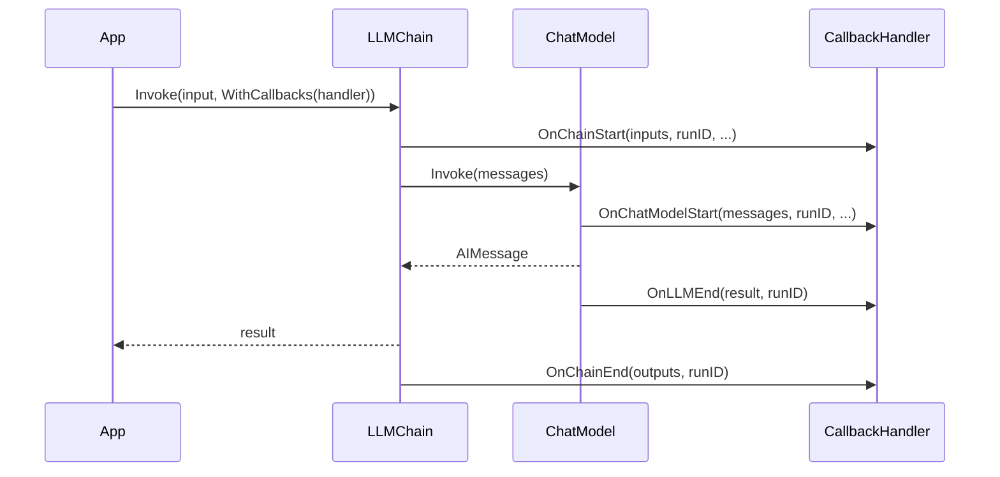
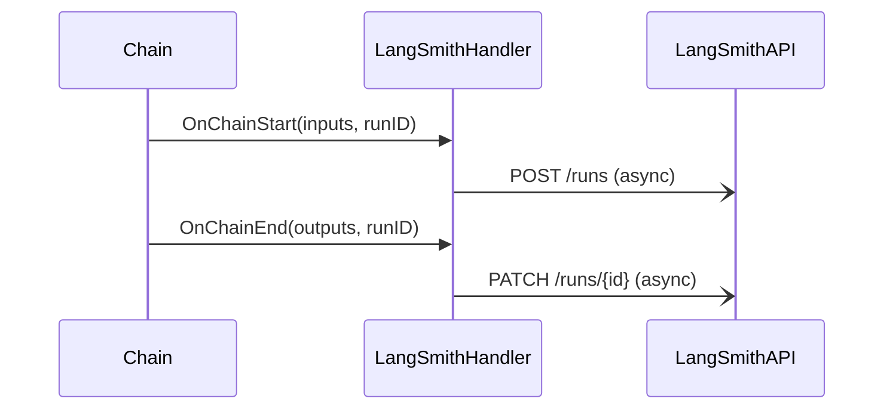

# Callbacks & Tracing

Callbacks provide lifecycle hooks into every component in langchain-go. They enable logging, tracing, monitoring, and integration with external observability platforms like LangSmith.

---

## How Callbacks Work

Every `Invoke`, `Stream`, and `Batch` call accepts `core.WithCallbacks(...)` as an option. When a callback is registered, the component fires events at key points in its execution.



Callbacks are passed via `core.RunnableConfig`. Components propagate them to sub-calls automatically.

---

## `CallbackHandler` Interface

```go
// core/callbacks.go
type CallbackHandler interface {
    // LLM events
    OnLLMStart(ctx context.Context, prompts []string, runID, parentRunID string, extra map[string]any)
    OnChatModelStart(ctx context.Context, messages []core.Message, runID, parentRunID string, extra map[string]any)
    OnLLMNewToken(ctx context.Context, token string, runID string)
    OnLLMEnd(ctx context.Context, result LLMResult, runID string)
    OnLLMError(ctx context.Context, err error, runID string)

    // Chain events
    OnChainStart(ctx context.Context, inputs map[string]any, runID, parentRunID string, extra map[string]any)
    OnChainEnd(ctx context.Context, outputs map[string]any, runID string)
    OnChainError(ctx context.Context, err error, runID string)

    // Tool events
    OnToolStart(ctx context.Context, tool, input, runID, parentRunID string, extra map[string]any)
    OnToolEnd(ctx context.Context, output, runID string)
    OnToolError(ctx context.Context, err error, runID string)

    // Agent events
    OnAgentAction(ctx context.Context, action AgentActionData, runID string)
    OnAgentFinish(ctx context.Context, finish AgentFinishData, runID string)

    // Retriever events
    OnRetrieverStart(ctx context.Context, query, runID, parentRunID string, extra map[string]any)
    OnRetrieverEnd(ctx context.Context, documents any, runID string)

    // Text
    OnText(ctx context.Context, text string)
}
```

### `BaseCallbackHandler`

Provides no-op implementations of every method. Embed it in your struct so you only need to override the events you care about:

```go
type MyHandler struct {
    core.BaseCallbackHandler
}

func (h *MyHandler) OnLLMNewToken(_ context.Context, token string, _ string) {
    fmt.Print(token) // stream tokens to stdout
}
```

---

## Built-in Handlers

### `StdoutHandler`

Prints all lifecycle events to stdout with optional ANSI coloring. Useful during development.

```go
import "github.com/LucaLanziani/langchain-go/callbacks"

handler := callbacks.NewStdoutHandler()
handler.Color = true // default

result, err := chain.Invoke(ctx, input, core.WithCallbacks(handler))
```

Sample output:
```
> Entering new LLMChain chain...
[LLM] Prompts: System: You are helpful. Human: Hello!
> Finished chain.
```

### `LangSmithHandler`

Sends run traces to [LangSmith](https://smith.langchain.com) for visualization, debugging, and evaluation. Events are sent asynchronously to avoid blocking the main execution path.

```go
import "github.com/LucaLanziani/langchain-go/callbacks"

handler := callbacks.NewLangSmithHandler("my-project")
// Automatically reads LANGCHAIN_API_KEY and LANGCHAIN_ENDPOINT from env.

result, err := chain.Invoke(ctx, input, core.WithCallbacks(handler))
```

**Required environment variables:**

| Variable | Description | Default |
|---|---|---|
| `LANGCHAIN_API_KEY` | LangSmith API key | — (required) |
| `LANGCHAIN_ENDPOINT` | LangSmith API endpoint | `https://api.smith.langchain.com` |
| `LANGCHAIN_PROJECT` | Project name | `"default"` |



---

## `callbacks.Manager`

`Manager` dispatches events to **multiple** handlers at once. Use it when you want to combine several handlers (e.g., stdout + LangSmith):

```go
manager := callbacks.NewManager(
    callbacks.NewStdoutHandler(),
    callbacks.NewLangSmithHandler("my-project"),
)

// Use any one of its handlers individually, or use manager.AllHandlers()
result, err := chain.Invoke(ctx, input, core.WithCallbacks(manager.AllHandlers()...))
```

Manager also supports **inheritable handlers** — handlers attached to a parent that automatically propagate to all child calls:

```go
manager := callbacks.NewManager().
    WithInheritableHandlers(callbacks.NewLangSmithHandler("production"))

child := manager.GetChild("sub-chain")
// child automatically has LangSmithHandler
```

---

## Writing a Custom Handler

```go
type MetricsHandler struct {
    core.BaseCallbackHandler

    LLMCallCount   int
    TotalTokensIn  int
    TotalTokensOut int
    mu             sync.Mutex
}

func (h *MetricsHandler) OnLLMEnd(_ context.Context, result core.LLMResult, _ string) {
    h.mu.Lock()
    defer h.mu.Unlock()
    h.LLMCallCount++
    if result.TokenUsage != nil {
        h.TotalTokensIn  += result.TokenUsage.InputTokens
        h.TotalTokensOut += result.TokenUsage.OutputTokens
    }
}

// Use it:
metrics := &MetricsHandler{}
for _, input := range inputs {
    chain.Invoke(ctx, input, core.WithCallbacks(metrics))
}
fmt.Printf("LLM calls: %d, tokens in: %d, tokens out: %d\n",
    metrics.LLMCallCount, metrics.TotalTokensIn, metrics.TotalTokensOut)
```

---

## Run IDs and Parent Run IDs

Every invocation gets a unique `RunID` (UUID) generated automatically by `DefaultConfig()`. Start/end events include the `RunID` so you can correlate them.

When a chain calls a sub-chain, it passes its own `RunID` as `parentRunID`. This creates a **run tree** visible in LangSmith:

```
AgentExecutor (runID=abc)
├── LLMChain (runID=def, parentRunID=abc)
│   └── ChatModel (runID=ghi, parentRunID=def)
└── Tool: calculator (runID=jkl, parentRunID=abc)
```

To set a custom run ID:

```go
result, err := chain.Invoke(ctx, input, core.WithRunID("my-trace-id"))
```
