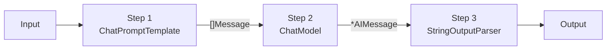
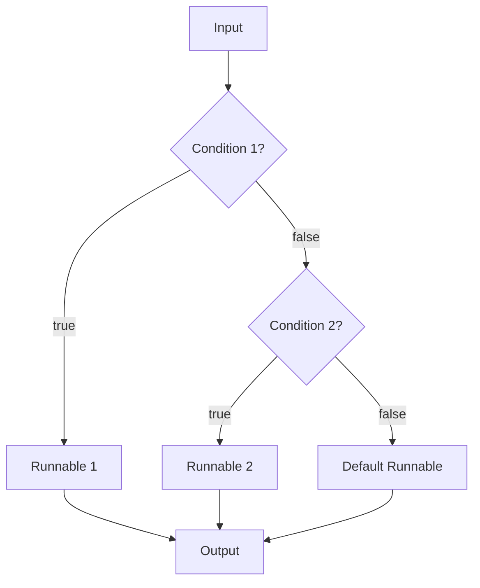
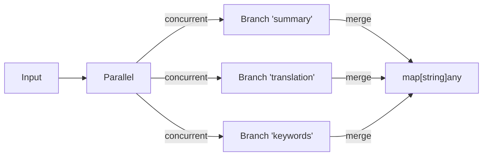
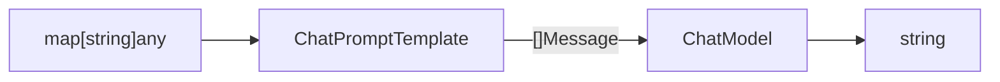
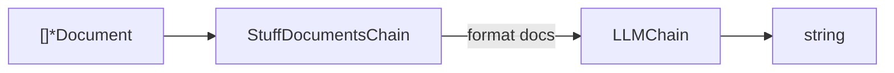
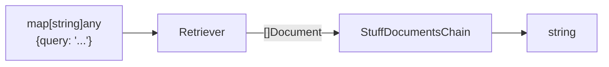

# Chains & Runnables

langchain-go provides two layers of composition: **predefined chains** for common patterns and **runnable combinators** (the Go equivalent of LangChain Expression Language, LCEL) for arbitrary pipelines.

---

## Runnable Combinators

The `runnable` package provides generic building blocks for constructing typed pipelines.

### `Sequence` — linear pipeline

`Sequence` chains runnables so that the output of each step becomes the input of the next.



Use the `Pipe2`, `Pipe3`, `Pipe4` constructors for type-safe composition:

```go
import (
    "github.com/LucaLanziani/langchain-go/runnable"
    "github.com/LucaLanziani/langchain-go/prompts"
    "github.com/LucaLanziani/langchain-go/providers/openai"
    "github.com/LucaLanziani/langchain-go/outputparsers"
)

prompt := prompts.NewChatPromptTemplate(
    prompts.System("You are a helpful assistant."),
    prompts.Human("Tell me about {topic}"),
)
model  := openai.New()
parser := outputparsers.NewStringOutputParser()

// 3-step pipeline: prompt → model → parser
chain := runnable.Pipe3(prompt, model, parser)
result, err := chain.Invoke(ctx, map[string]any{"topic": "Go generics"})
```

| Constructor | Steps | Description |
|---|---|---|
| `Pipe2(a, b)` | 2 | `Runnable[I, M]` + `Runnable[M, O]` → `Sequence[I, O]` |
| `Pipe3(a, b, c)` | 3 | Adds a third step |
| `Pipe4(a, b, c, d)` | 4 | Adds a fourth step |
| `Pipe(steps...)` | N | Variadic, uses type erasure for intermediate types |

The `Sequence` itself implements `Runnable[I, O]`, so it composes naturally with other primitives.

---

### `Branch` — conditional routing

`Branch` evaluates a list of conditions and delegates to the first matching runnable. A default branch handles the fallback case.



```go
branch := runnable.NewBranch[map[string]any, string](
    []runnable.BranchCondition[map[string]any, string]{
        {
            Condition: func(input map[string]any) bool {
                lang, _ := input["lang"].(string)
                return lang == "go"
            },
            Runnable: goChain,
        },
        {
            Condition: func(input map[string]any) bool {
                lang, _ := input["lang"].(string)
                return lang == "python"
            },
            Runnable: pythonChain,
        },
    },
    defaultChain, // fallback when no condition matches
)

result, err := branch.Invoke(ctx, map[string]any{"lang": "go", "question": "..."})
```

---

### `Parallel` — fan-out

`Parallel` runs multiple runnables concurrently with the same input and collects all outputs into `map[string]any`.



```go
parallel := runnable.NewParallel[map[string]any, string](
    map[string]core.Runnable[map[string]any, string]{
        "summary":     summaryChain,
        "translation": translationChain,
        "keywords":    keywordsChain,
    },
)

// Returns map["summary": "...", "translation": "...", "keywords": "..."]
results, err := parallel.Invoke(ctx, input)
```

Use `core.WithMaxConcurrency(n)` to limit the number of goroutines running simultaneously.

For heterogeneous output types, use `NewParallelAny`:

```go
parallel := runnable.NewParallelAny[map[string]any](
    map[string]func(ctx context.Context, input map[string]any, opts ...core.Option) (any, error){
        "count": func(ctx context.Context, input map[string]any, opts ...core.Option) (any, error) {
            return 42, nil
        },
        "text": func(ctx context.Context, input map[string]any, opts ...core.Option) (any, error) {
            return "hello", nil
        },
    },
)
```

---

### `Lambda` — function wrapper

`Lambda` turns any Go function into a `Runnable`, which is useful for inline transformations in a pipeline.

```go
upper := runnable.NewLambda[string, string](
    func(_ context.Context, s string) (string, error) {
        return strings.ToUpper(s), nil
    },
).WithName("upper-case")

chain := runnable.Pipe3(prompt, model, upper)
```

---

### `Passthrough` — identity

`Passthrough` returns its input unchanged. Useful as a placeholder or when you need to pass data through without modification.

```go
pt := runnable.NewPassthrough[string]()
result, _ := pt.Invoke(ctx, "hello") // returns "hello"
```

### `Assign` — augment a map

`Assign` is like `Parallel` but instead of replacing the input, it *adds* new keys to the existing map. Useful for RAG pipelines where you want to keep the original query and add retrieved context.

```go
augment := runnable.NewAssign[map[string]any](
    map[string]func(ctx context.Context, input map[string]any, opts ...core.Option) (any, error){
        "context": func(ctx context.Context, input map[string]any, opts ...core.Option) (any, error) {
            query, _ := input["query"].(string)
            docs, err := retriever.GetRelevantDocuments(ctx, query)
            // format docs into a string...
            return formatted, err
        },
    },
)
// Input: {"query": "..."} → Output: {"query": "...", "context": "..."}
```

---

## Predefined Chains

The `chains` package provides higher-level chains for common patterns.

### `LLMChain` — prompt + model

The simplest chain: formats a prompt template and sends it to a model.



```go
import "github.com/LucaLanziani/langchain-go/chains"

prompt := prompts.NewChatPromptTemplate(
    prompts.System("Translate to French:"),
    prompts.Human("{text}"),
)

chain := chains.NewLLMChain(openai.New(), prompt)

result, err := chain.Invoke(ctx, map[string]any{"text": "Hello, world!"})
// result == "Bonjour, le monde!"
```

`LLMChain` implements `Runnable[map[string]any, string]` and supports all three invocation methods (`Invoke`, `Stream`, `Batch`).

---

### `StuffDocumentsChain` — stuff docs into context

Concatenates a slice of documents into a single context string and passes it to an `LLMChain`.



```go
qaChain := chains.NewStuffDocumentsChain(llmChain, "context")

docs := []*core.Document{
    core.NewDocument("Go was created in 2009."),
    core.NewDocument("Go supports generics since 1.18."),
}

answer, err := qaChain.Invoke(ctx, docs)
```

---

### `RetrievalQA` — retriever + LLM

Wires a retriever and an LLM chain together for question-answering over documents.



```go
retriever := retrievers.NewVectorStoreRetriever(store, 4)
llmChain  := chains.NewLLMChain(model, qaPrompt)
qaChain   := chains.NewRetrievalQA(retriever, llmChain)

answer, err := qaChain.Invoke(ctx, map[string]any{
    "query": "When was Go created?",
})
```

---

## Output Parsers

Output parsers are `Runnable` components that transform `*core.AIMessage` into structured data.

### `StringOutputParser`

Extracts the text content from a message:

```go
parser := outputparsers.NewStringOutputParser()
text, err := parser.Invoke(ctx, aiMsg)
```

### `JSONOutputParser`

Parses the message content as JSON into a `map[string]any`:

```go
parser := outputparsers.NewJSONOutputParser()
data, err := parser.Invoke(ctx, aiMsg)
```

---

## Prompt Templates

### `ChatPromptTemplate`

Builds a list of `core.Message` from a mix of template strings and message placeholders.

```go
prompt := prompts.NewChatPromptTemplate(
    prompts.System("You are a {role}."),
    prompts.Placeholder("history"),    // injects []Message from inputs["history"]
    prompts.Human("{question}"),
)

messages, err := prompt.FormatMessages(map[string]any{
    "role":     "helpful assistant",
    "history":  existingMessages,
    "question": "What is Go?",
})
```

**Template variable syntax:** `{variable_name}` in any string template.

| Constructor | Message type | Template |
|---|---|---|
| `prompts.System(tmpl)` | `SystemMessage` | Go `text/template`-style `{var}` |
| `prompts.Human(tmpl)` | `HumanMessage` | same |
| `prompts.AI(tmpl)` | `AIMessage` | same |
| `prompts.Placeholder(key)` | — | Injects `[]Message` from inputs[key] |

`ChatPromptTemplate` also implements `Runnable[map[string]any, []core.Message]`, so it composes directly into a `Sequence`.

### `PromptTemplate`

A simpler single-string template that produces a formatted string:

```go
pt := prompts.NewPromptTemplate("Hello, {name}! You are {age} years old.")
text, err := pt.Format(map[string]any{"name": "Alice", "age": 30})
// "Hello, Alice! You are 30 years old."
```
