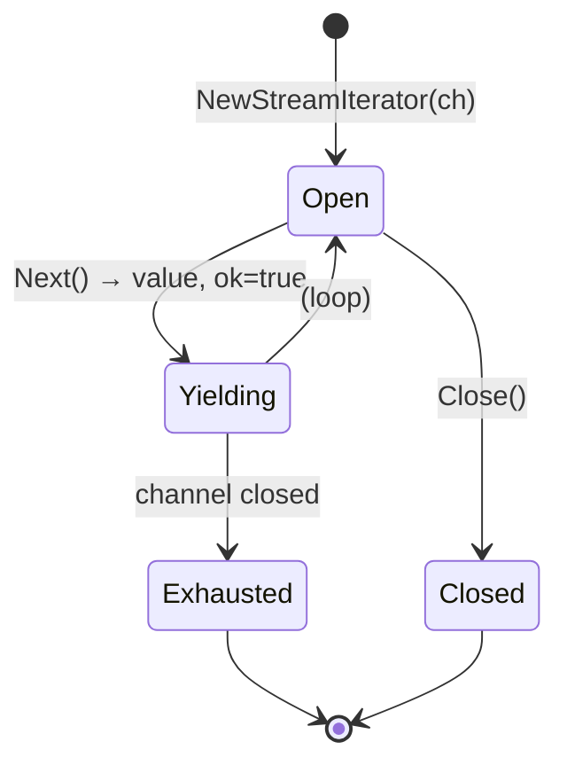
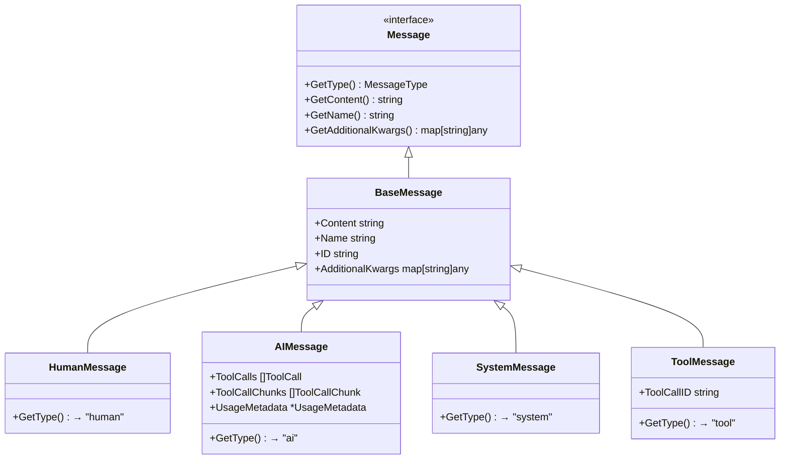

# Core Concepts

This document covers the fundamental building blocks of langchain-go: the interfaces and types that every other package relies on.

---

## The `Runnable[I, O]` Interface

`Runnable` is the central abstraction. Every component — prompts, models, parsers, retrievers, chains, agents — implements it.

```go
// core/runnable.go
type Runnable[I, O any] interface {
    Invoke(ctx context.Context, input I, opts ...Option) (O, error)
    Stream(ctx context.Context, input I, opts ...Option) (*StreamIterator[O], error)
    Batch(ctx context.Context, inputs []I, opts ...Option) ([]O, error)
    GetName() string
}
```

| Method | Purpose |
|---|---|
| `Invoke` | Execute once, return a single output |
| `Stream` | Execute and receive output incrementally as it is produced |
| `Batch` | Execute for multiple inputs, returns a slice of outputs |
| `GetName` | Returns a display name used in tracing |

### Why generics?

Python's LangChain uses duck typing; Go's type system requires explicit types. By making `Runnable` generic over `I` (input) and `O` (output), the compiler verifies that you are composing components correctly. For example, `Pipe3(prompt, model, parser)` only compiles when the output type of `prompt` matches the input type of `model`.

---

## `StreamIterator[T]`

Streaming output is delivered through a pull-based iterator wrapping a Go channel.

```go
stream, err := model.Stream(ctx, messages)
// ...
for {
    chunk, ok, err := stream.Next()
    if err != nil { /* handle */ }
    if !ok { break } // stream exhausted
    fmt.Print(chunk.Content)
}
stream.Close() // release resources if breaking early
```

**Methods:**

| Method | Signature | Description |
|---|---|---|
| `Next` | `() (T, bool, error)` | Pull the next chunk; `ok=false` means stream is done |
| `Collect` | `() ([]T, error)` | Drain all remaining chunks into a slice |
| `Close` | `()` | Signal early termination to avoid goroutine leaks |



---

## Messages

All communication between the application and LLMs is expressed as **messages**. Every message implements the `Message` interface:

```go
type Message interface {
    GetType() MessageType
    GetContent() string
    GetName() string
    GetAdditionalKwargs() map[string]any
}
```

### Message Types



### Constructors

```go
core.NewHumanMessage("Hello!")
core.NewAIMessage("Hi there!")
core.NewSystemMessage("You are a helpful assistant.")
core.NewToolMessage("42", toolCallID)
core.NewAIMessageWithToolCalls("", []core.ToolCall{...})
```

### `ToolCall` and `ToolCallChunk`

`ToolCall` is embedded in `AIMessage` when the model requests a tool invocation:

```go
type ToolCall struct {
    ID   string          `json:"id"`
    Name string          `json:"name"`
    Args json.RawMessage `json:"args"` // raw JSON args from the model
}
```

`ToolCallChunk` is used during streaming when the tool call arrives in pieces:

```go
type ToolCallChunk struct {
    ID    string `json:"id,omitempty"`
    Name  string `json:"name,omitempty"`
    Args  string `json:"args,omitempty"` // partial JSON string
    Index int    `json:"index,omitempty"`
}
```

### `UsageMetadata`

Token usage is attached to `AIMessage` when returned by the provider:

```go
type UsageMetadata struct {
    InputTokens  int `json:"input_tokens"`
    OutputTokens int `json:"output_tokens"`
    TotalTokens  int `json:"total_tokens"`
}
```

---

## `RunnableConfig` and Options

Every `Invoke`, `Stream`, and `Batch` call accepts a variadic `...core.Option` parameter for per-call configuration.

```go
result, err := chain.Invoke(ctx, input,
    core.WithTags("my-tag"),
    core.WithRunName("my-run"),
    core.WithCallbacks(myHandler),
    core.WithStop("\nObservation:"),
    core.WithMaxConcurrency(4),
)
```

### `RunnableConfig` fields

| Field | Type | Default | Description |
|---|---|---|---|
| `Tags` | `[]string` | `nil` | Labels propagated to sub-calls, used for filtering in tracing |
| `Metadata` | `map[string]any` | `{}` | Arbitrary key-value pairs for tracing |
| `Callbacks` | `[]CallbackHandler` | `nil` | Lifecycle event handlers for this call |
| `RunName` | `string` | component name | Overrides the display name in traces |
| `MaxConcurrency` | `int` | `0` (unlimited) | Limits parallel calls in `Batch` operations |
| `RecursionLimit` | `int` | `25` | Maximum recursion depth for nested runnables |
| `RunID` | `string` | auto UUID | Unique identifier for this invocation |
| `Stop` | `[]string` | `nil` | Stop sequences passed to the model |
| `Configurable` | `map[string]any` | `nil` | Runtime-configurable values (e.g., model name swap) |

### Option constructors

```go
core.WithTags("production", "v2")
core.WithMetadata(map[string]any{"user": "alice"})
core.WithCallbacks(handler1, handler2)
core.WithRunName("qa-chain")
core.WithMaxConcurrency(8)
core.WithRecursionLimit(10)
core.WithRunID("my-custom-id")
core.WithStop("\nHuman:")
core.WithConfigurable(map[string]any{"model": "gpt-4o-mini"})
```

---

## Callbacks

The `CallbackHandler` interface defines lifecycle hooks that fire at every step of a pipeline run. Any struct that embeds `core.BaseCallbackHandler` gets no-op implementations of all methods, so you only override what you need.

```go
type CallbackHandler interface {
    // LLM lifecycle
    OnLLMStart(ctx, serialized, prompts, runID, parentRunID string, extra map[string]any)
    OnLLMNewToken(ctx context.Context, token string, runID string)
    OnLLMEnd(ctx context.Context, result LLMResult, runID string)
    OnLLMError(ctx context.Context, err error, runID string)

    // Chain lifecycle
    OnChainStart(ctx context.Context, inputs map[string]any, runID, parentRunID string, extra map[string]any)
    OnChainEnd(ctx context.Context, outputs map[string]any, runID string)
    OnChainError(ctx context.Context, err error, runID string)

    // Tool lifecycle
    OnToolStart(ctx context.Context, tool, input, runID, parentRunID string, extra map[string]any)
    OnToolEnd(ctx context.Context, output, runID string)
    OnToolError(ctx context.Context, err error, runID string)

    // Agent lifecycle
    OnAgentAction(ctx context.Context, action AgentActionData, runID string)
    OnAgentFinish(ctx context.Context, finish AgentFinishData, runID string)

    // Other
    OnRetrieverStart(ctx context.Context, query, runID, parentRunID string, extra map[string]any)
    OnRetrieverEnd(ctx context.Context, documents any, runID string)
    OnText(ctx context.Context, text string)
}
```

### Writing a custom callback handler

```go
type MyLogger struct {
    core.BaseCallbackHandler // provides no-op defaults
}

func (l *MyLogger) OnLLMStart(_ context.Context, _, _ string, runID, _ string, _ map[string]any) {
    fmt.Printf("[%s] LLM started\n", runID)
}

func (l *MyLogger) OnLLMEnd(_ context.Context, result core.LLMResult, runID string) {
    fmt.Printf("[%s] LLM finished, tokens: %+v\n", runID, result.TokenUsage)
}

// Use it:
chain.Invoke(ctx, input, core.WithCallbacks(&MyLogger{}))
```

---

## `Document`

The unit of text used in RAG pipelines:

```go
type Document struct {
    PageContent string         `json:"page_content"`
    Metadata    map[string]any `json:"metadata,omitempty"`
    ID          string         `json:"id,omitempty"`
}

doc := core.NewDocument("Go was created at Google in 2007.")
doc.Metadata["source"] = "wikipedia"
```
