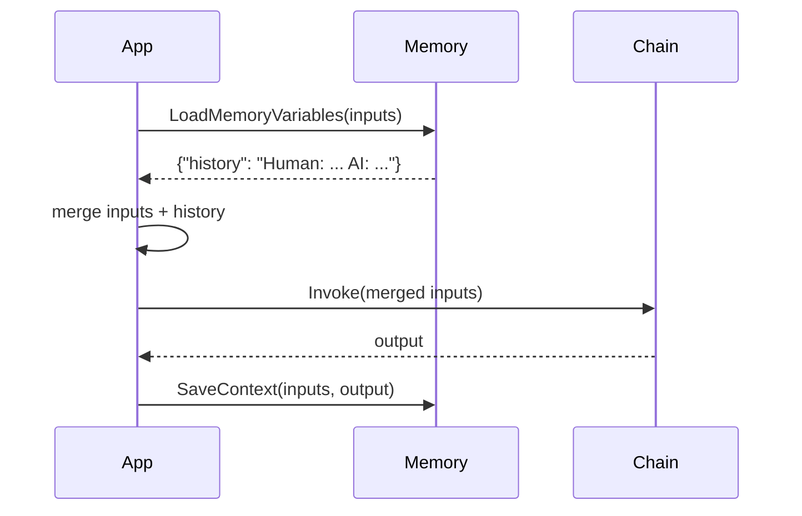
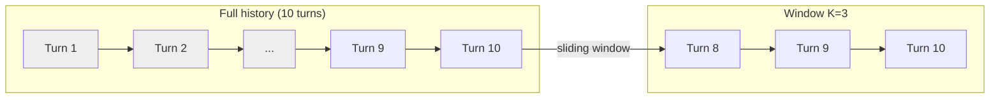

# Memory

Memory allows a chain or agent to maintain state across multiple interactions. Without memory, every invocation starts from scratch. With memory, the conversation history is loaded before each call and saved afterwards.

---

## The `Memory` Interface

```go
// memory/memory.go
type Memory interface {
    // MemoryVariables returns the keys this memory injects into chain inputs.
    MemoryVariables() []string

    // LoadMemoryVariables loads conversation history into a variable map.
    LoadMemoryVariables(ctx context.Context, inputs map[string]any) (map[string]any, error)

    // SaveContext saves the inputs and outputs of a run to memory.
    SaveContext(ctx context.Context, inputs map[string]any, outputs map[string]any) error

    // Clear resets the memory state.
    Clear(ctx context.Context) error
}
```

The typical usage pattern is:



---

## `ConversationBufferMemory`

Stores the **entire** conversation history. Simple and effective for short conversations.

```go
import "github.com/LucaLanziani/langchain-go/memory"

mem := memory.NewConversationBufferMemory()

// Optionally configure:
mem.MemoryKey      = "history"   // key injected into chain inputs
mem.InputKey       = "input"     // key for human message in inputs
mem.OutputKey      = "output"    // key for AI reply in outputs
mem.ReturnMessages = false       // true = inject []Message, false = inject formatted string
mem.MaxMessages    = 0           // 0 = unlimited, >0 = keep last N messages
```

### Integration with a chain

```go
mem := memory.NewConversationBufferMemory()
chain := chains.NewLLMChain(model, prompt) // prompt uses {history} and {input}

// Turn 1
memVars, _  := mem.LoadMemoryVariables(ctx, inputs)
inputs["history"] = memVars["history"]
out, _      := chain.Invoke(ctx, inputs)
mem.SaveContext(ctx, inputs, map[string]any{"output": out})

// Turn 2
memVars, _  = mem.LoadMemoryVariables(ctx, inputs2)
inputs2["history"] = memVars["history"]
out2, _     = chain.Invoke(ctx, inputs2)
mem.SaveContext(ctx, inputs2, map[string]any{"output": out2})
```

---

## `ConversationWindowMemory`

Stores only the last **K conversation turns** (where one turn = one human + one AI message). Useful to keep context window costs bounded.

```go
mem := memory.NewConversationWindowMemory(5) // keep last 5 turns

mem.K              = 5
mem.MemoryKey      = "history"
mem.ReturnMessages = true  // inject []Message instead of string
```



---

## `ChatMessageHistory`

`ChatMessageHistory` is the low-level, thread-safe message store. Both buffer and window memory use it internally, but you can also use it directly when you need fine-grained control.

```go
history := memory.NewChatMessageHistory()

history.AddUserMessage(ctx, "Hello!")
history.AddAIMessage(ctx, "Hi there!")
history.AddMessage(ctx, core.NewSystemMessage("Be concise."))

msgs := history.GetMessages(ctx) // []core.Message
history.SetMessages(ctx, existingMsgs) // replace all
history.Clear(ctx)               // reset
```

### Methods

| Method | Description |
|---|---|
| `AddMessage(ctx, Message)` | Append any `core.Message` |
| `AddUserMessage(ctx, content)` | Append a `HumanMessage` |
| `AddAIMessage(ctx, content)` | Append an `AIMessage` |
| `GetMessages(ctx)` | Return a copy of all messages |
| `SetMessages(ctx, []Message)` | Replace entire history |
| `Clear(ctx)` | Remove all messages |

All operations are protected by `sync.RWMutex` — safe for concurrent access.

---

## `ReturnMessages` vs. string format

When `ReturnMessages = false` (default), the memory formats the history as a human-readable string:

```
Human: Hello!
AI: Hi there!
Human: What is Go?
AI: Go is a statically typed language...
```

When `ReturnMessages = true`, it returns a `[]core.Message` slice directly, which you can inject as a `Placeholder` in a `ChatPromptTemplate`.

### String format mode example

```go
// prompt expects {history} as a string and {input} as a string
prompt := prompts.NewChatPromptTemplate(
    prompts.System("You are a helpful assistant.\n\nConversation so far:\n{history}"),
    prompts.Human("{input}"),
)
```

### Messages mode example

```go
mem := memory.NewConversationBufferMemory()
mem.ReturnMessages = true

// prompt injects []Message directly via Placeholder
prompt := prompts.NewChatPromptTemplate(
    prompts.System("You are a helpful assistant."),
    prompts.Placeholder("history"), // receives []core.Message
    prompts.Human("{input}"),
)
```
