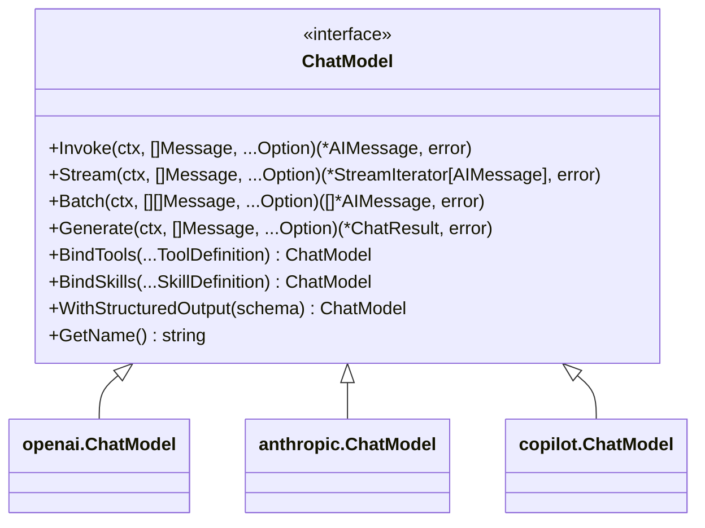
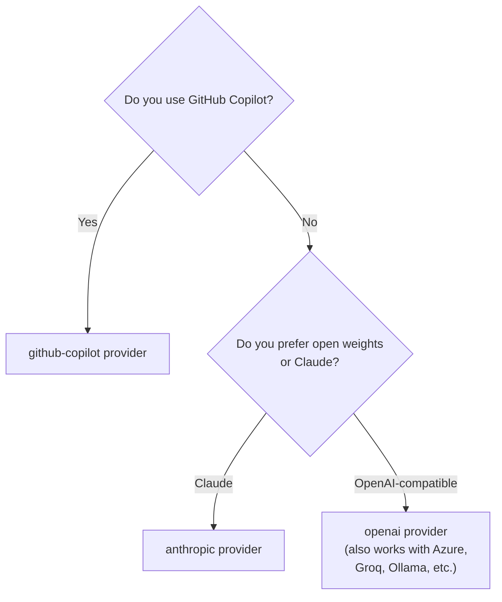

# Providers

Providers are concrete implementations of the `llms.ChatModel` interface. They communicate with LLM APIs on your behalf and translate the common `core.Message` types into each provider's wire format.

---

## `ChatModel` Interface

All providers implement:

```go
// llms/chatmodel.go
type ChatModel interface {
    core.Runnable[[]core.Message, *core.AIMessage]

    // Generate is the lower-level batched inference call.
    Generate(ctx context.Context, messages []core.Message, opts ...core.Option) (*ChatResult, error)

    // BindTools returns a new ChatModel that will always send tool definitions.
    BindTools(tools ...ToolDefinition) ChatModel

    // BindSkills returns a new ChatModel that will always send skill definitions
    // when the provider supports native skills.
    BindSkills(skills ...SkillDefinition) ChatModel

    // WithStructuredOutput returns a ChatModel configured for structured JSON output.
    WithStructuredOutput(schema map[string]any) ChatModel
}
```

`ChatModel` extends `Runnable[[]core.Message, *core.AIMessage]`, so `Invoke` accepts a slice of messages and returns a single `AIMessage`.



---

## OpenAI

**Package:** `github.com/LucaLanziani/langchain-go/providers/openai`

### Usage

```go
import "github.com/LucaLanziani/langchain-go/providers/openai"

// Reads OPENAI_API_KEY from environment automatically.
model := openai.New()

// With explicit options:
model = openai.New(
    openai.WithAPIKey("sk-..."),
    openai.WithModelName("gpt-4o-mini"),
    openai.WithBaseURL("https://api.openai.com/v1"),
)

// Invoke
resp, err := model.Invoke(ctx, []core.Message{
    core.NewSystemMessage("You are a helpful assistant."),
    core.NewHumanMessage("Hello!"),
})
fmt.Println(resp.Content)
```

### Options

| Option | Default | Description |
|---|---|---|
| `WithAPIKey(key)` | `$OPENAI_API_KEY` | API key |
| `WithModelName(model)` | `"gpt-4o"` | Model identifier |
| `WithBaseURL(url)` | `"https://api.openai.com/v1"` | Base URL (useful for proxies or Azure OpenAI) |
| `WithOrganization(org)` | — | OpenAI organization ID |

> Global inference options (`WithTemperature`, `WithMaxTokens`, `WithTopP`) from `llms/options.go` are also accepted by all `Invoke`/`Stream`/`Batch` calls via `core.Option`.

### Embeddings

```go
import "github.com/LucaLanziani/langchain-go/providers/openai"

embedder := openai.NewEmbeddings()
// With options:
embedder = openai.NewEmbeddings(
    openai.WithAPIKey("sk-..."),
    openai.WithEmbeddingModel("text-embedding-3-small"),
)

vecs, err := embedder.EmbedDocuments(ctx, []string{"Hello", "World"})
vec, err  := embedder.EmbedQuery(ctx, "What is Go?")
```

### Streaming

```go
stream, err := model.Stream(ctx, messages)
defer stream.Close()
for {
    chunk, ok, err := stream.Next()
    if err != nil || !ok { break }
    fmt.Print(chunk.Content) // partial token
}
```

---

## Anthropic

**Package:** `github.com/LucaLanziani/langchain-go/providers/anthropic`

### Usage

```go
import "github.com/LucaLanziani/langchain-go/providers/anthropic"

// Reads ANTHROPIC_API_KEY from environment automatically.
model := anthropic.New()

model = anthropic.New(
    anthropic.WithAPIKey("sk-ant-..."),
    anthropic.WithModelName("claude-3-haiku-20240307"),
    anthropic.WithMaxTokens(1024),
)
```

### Options

| Option | Default | Description |
|---|---|---|
| `WithAPIKey(key)` | `$ANTHROPIC_API_KEY` | API key |
| `WithModelName(model)` | `"claude-sonnet-4-20250514"` | Model identifier |
| `WithBaseURL(url)` | `"https://api.anthropic.com/v1"` | Base URL override |
| `WithMaxTokens(n)` | `4096` | Maximum output tokens (required by Anthropic API) |

### System message handling

Anthropic's API accepts the system message as a top-level field, not inside the messages array. The provider automatically extracts the first `SystemMessage` from your slice and places it correctly.

---

## GitHub Copilot

**Package:** `github.com/LucaLanziani/langchain-go/providers/github-copilot`

This provider uses the [Copilot SDK](https://github.com/github/copilot-sdk) to communicate with GitHub Copilot models. It requires the Copilot CLI to be installed.

### Usage

```go
import copilot "github.com/LucaLanziani/langchain-go/providers/github-copilot"

// Reads GITHUB_TOKEN from environment automatically.
model, err := copilot.New()
defer model.Close()

model, err = copilot.New(
    copilot.WithGithubToken("ghp_..."),
    copilot.WithModelName("gpt-5"),
    copilot.WithMaxConcurrency(3),
)
```

### Options

| Option | Default | Description |
|---|---|---|
| `WithGithubToken(token)` | `$GITHUB_TOKEN` | GitHub personal access token |
| `WithModelName(model)` | `"gpt-5-mini"` | Model identifier |
| `WithCLIPath(path)` | `"copilot"` | Path to the Copilot CLI executable |
| `WithLogLevel(level)` | `"error"` | Log level for the CLI server |
| `WithMaxConcurrency(n)` | `5` | Maximum parallel sessions in `Batch` |
| `WithTools(tools...)` | — | Pre-bind tools; the SDK manages the tool-calling loop internally |

> **Important:** Always call `model.Close()` when done to shut down the underlying CLI server process.

### Bridged tool calling

The Copilot provider bridges langchain `Tool` implementations into the SDK's native tool format. When you supply tools via `WithTools`, the SDK automatically handles the tool-calling loop:

```go
model, err := copilot.New(
    copilot.WithTools(myTool1, myTool2),
)
```

---

## Tool Calling

All providers support native tool calling via `BindTools`:

```go
calc := tools.NewTool("calculator", "Evaluate math expressions.",
    func(_ context.Context, input string) (string, error) {
        return "42", nil
    },
)

// Bind tools to any model
boundModel := model.BindTools(tools.ToDefinition(calc))

resp, err := boundModel.Invoke(ctx, messages)
if len(resp.ToolCalls) > 0 {
    // Model wants to call a tool
    for _, tc := range resp.ToolCalls {
        fmt.Println(tc.Name, string(tc.Args))
    }
}
```

### `ToolDefinition`

```go
// llms/chatmodel.go
type ToolDefinition struct {
    Name        string         `json:"name"`
    Description string         `json:"description"`
    Parameters  map[string]any `json:"parameters"` // JSON Schema
}
```

### `SkillDefinition`

```go
// llms/chatmodel.go
type SkillDefinition struct {
    Name         string         `json:"name"`
    Description  string         `json:"description"`
    Instructions string         `json:"instructions"`
    Parameters   map[string]any `json:"parameters"` // Optional JSON Schema
}
```

## Skills

Models and routers can also bind provider-native skills:

```go
reviewSkill := llms.SkillDefinition{
    Name:         "review",
    Description:  "Review code changes for regressions.",
    Instructions: "Prioritize correctness, behavioral regressions, and missing tests.",
}

model = model.BindSkills(reviewSkill)
router.BindSkills(reviewSkill)
```

Binding skills is provider-dependent in the current release. Supported providers preserve and propagate the bound definitions, but providers without a concrete native mapping ignore them silently instead of failing or emulating skills through prompt injection.

---

## Structured Output

Force the model to return valid JSON matching a schema:

```go
schema := map[string]any{
    "type": "object",
    "properties": map[string]any{
        "name":  map[string]any{"type": "string"},
        "score": map[string]any{"type": "number"},
    },
    "required": []string{"name", "score"},
}

structuredModel := model.WithStructuredOutput(schema)
resp, err := structuredModel.Invoke(ctx, messages)
// resp.Content is a JSON string matching the schema
```

---

## Choosing a Provider



The OpenAI provider works with any OpenAI-compatible API by overriding `WithBaseURL`. Point it at Groq, Ollama, or Azure OpenAI Service as needed.
