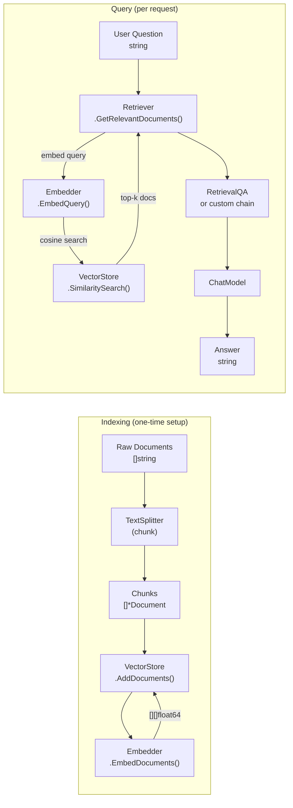
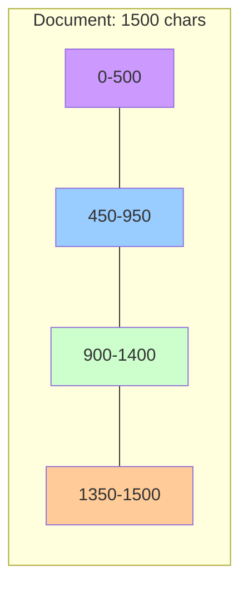

# RAG Pipeline

**Retrieval-Augmented Generation (RAG)** is the technique of augmenting an LLM's knowledge by retrieving relevant documents from a database and injecting them into the prompt. This allows the model to answer questions about documents it was not trained on.

---

## Pipeline Overview



---

## Components

### `Embedder` interface

Converts text to dense vector representations:

```go
// embeddings/embeddings.go
type Embedder interface {
    EmbedDocuments(ctx context.Context, texts []string) ([][]float64, error)
    EmbedQuery(ctx context.Context, text string) ([]float64, error)
}
```

The distinction between `EmbedDocuments` and `EmbedQuery` matters for some models (e.g., Cohere's reranking models use different embeddings). For OpenAI, both call the same API endpoint.

**Available embedder:** `openai.NewEmbeddings()` (uses `text-embedding-ada-002` by default).

### `VectorStore` interface

Stores embedded documents and performs similarity search:

```go
// vectorstores/vectorstore.go
type VectorStore interface {
    AddDocuments(ctx context.Context, documents []*core.Document) ([]string, error)
    SimilaritySearch(ctx context.Context, query string, k int) ([]*core.Document, error)
    SimilaritySearchWithScore(ctx context.Context, query string, k int) ([]DocumentWithScore, error)
    Delete(ctx context.Context, ids []string) error
    GetEmbedder() embeddings.Embedder
}
```

**Available implementation:** `inmemory.Store` — in-memory cosine similarity search.

### `Retriever` interface

Wraps a vector store, implements `Runnable[string, []*core.Document]`:

```go
// retrievers/retriever.go
type Retriever interface {
    core.Runnable[string, []*core.Document]
    GetRelevantDocuments(ctx context.Context, query string) ([]*core.Document, error)
}
```

### `RecursiveCharacterTextSplitter`

Splits long documents into chunks that fit within a model's context window. It tries separators in order (`\n\n`, `\n`, ` `, `""`) and recurses until all chunks are at most `ChunkSize` characters.

```go
// textsplitters/recursive.go
splitter := textsplitters.NewRecursiveCharacterTextSplitter(
    500,  // chunk size in characters
    50,   // overlap between chunks
)

// Custom separators:
splitter.WithSeparators([]string{"\n\n", "\n", ". ", " ", ""})
```

The `ChunkOverlap` ensures that no information is lost at chunk boundaries — each chunk shares `ChunkOverlap` characters with the previous one.



---

## In-Memory Vector Store

```go
import (
    "github.com/LucaLanziani/langchain-go/providers/openai"
    "github.com/LucaLanziani/langchain-go/vectorstores/inmemory"
)

embedder := openai.NewEmbeddings()
store     := inmemory.New(embedder)

// Add documents
ids, err := store.AddDocuments(ctx, []*core.Document{
    core.NewDocument("Go was created in 2009."),
    core.NewDocument("Go 1.18 introduced generics."),
})

// Search
docs, err := store.SimilaritySearch(ctx, "Go generics", 2)

// Search with scores (cosine similarity, 0–1)
results, err := store.SimilaritySearchWithScore(ctx, "Go generics", 2)
for _, r := range results {
    fmt.Printf("score=%.3f  content=%s\n", r.Score, r.Document.PageContent)
}

// Delete
err = store.Delete(ctx, ids)
```

The in-memory store uses **cosine similarity** over float64 vectors. It is suitable for development, testing, and small datasets.

---

## Building a RAG Pipeline

### Step 1: Index documents

```go
// Split long documents into chunks
splitter := textsplitters.NewRecursiveCharacterTextSplitter(500, 50)
chunks    := splitter.SplitDocuments(rawDocs)

// Create embeddings + store
embedder := openai.NewEmbeddings()
store     := inmemory.New(embedder)

ids, err := store.AddDocuments(ctx, chunks)
```

### Step 2: Create retriever

```go
// k=4 returns the top-4 most relevant chunks
retriever := retrievers.NewVectorStoreRetriever(store, 4)
```

### Step 3: Create the QA chain

```go
qaPrompt := prompts.NewChatPromptTemplate(
    prompts.System(`Answer the question using ONLY the following context.
If the answer is not in the context, say "I don't know."

Context:
{context}`),
    prompts.Human("{query}"),
)

llmChain := chains.NewLLMChain(openai.New(), qaPrompt)
qaChain  := chains.NewRetrievalQA(retriever, llmChain)
```

### Step 4: Query

```go
answer, err := qaChain.Invoke(ctx, map[string]any{
    "query": "When were generics introduced in Go?",
})
fmt.Println(answer) // "Go 1.18 introduced generics."
```

---

## Complete Example

```go
package main

import (
    "context"
    "fmt"
    "log"

    "github.com/LucaLanziani/langchain-go/chains"
    "github.com/LucaLanziani/langchain-go/core"
    "github.com/LucaLanziani/langchain-go/prompts"
    "github.com/LucaLanziani/langchain-go/providers/openai"
    "github.com/LucaLanziani/langchain-go/retrievers"
    "github.com/LucaLanziani/langchain-go/textsplitters"
    "github.com/LucaLanziani/langchain-go/vectorstores/inmemory"
)

func main() {
    ctx := context.Background()

    docs := []*core.Document{
        core.NewDocument("Go was designed at Google in 2007 by Robert Griesemer, Rob Pike, and Ken Thompson."),
        core.NewDocument("Go is statically typed, compiled, and has garbage collection and CSP-style concurrency."),
        core.NewDocument("Go 1.18, released in March 2022, introduced generics via type parameters."),
    }

    splitter := textsplitters.NewRecursiveCharacterTextSplitter(200, 20)
    chunks   := splitter.SplitDocuments(docs)

    store := inmemory.New(openai.NewEmbeddings())
    if _, err := store.AddDocuments(ctx, chunks); err != nil {
        log.Fatal(err)
    }

    retriever := retrievers.NewVectorStoreRetriever(store, 2)

    qaPrompt := prompts.NewChatPromptTemplate(
        prompts.System("Answer based only on this context:\n\n{context}"),
        prompts.Human("{query}"),
    )

    qaChain := chains.NewRetrievalQA(
        retriever,
        chains.NewLLMChain(openai.New(), qaPrompt),
    )

    answer, err := qaChain.Invoke(ctx, map[string]any{"query": "Who created Go?"})
    if err != nil {
        log.Fatal(err)
    }
    fmt.Println(answer)
}
```

---

## Tips

- **Chunk size matters.** Too large = noisy context; too small = incomplete answers. 300–800 characters is a good starting range.
- **K matters.** More retrieved chunks = more context, but higher cost and possible confusion. Start with `k=3` or `k=4`.
- **Document metadata.** Set `doc.Metadata["source"]` to track which document a chunk came from. Useful for citations.
- **The in-memory store** is not persistent. For production, replace it with a persistent vector store that implements `vectorstores.VectorStore` (e.g., Pinecone, pgvector, Weaviate).
