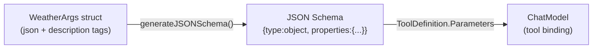

# Tools

Tools are named, described functions that agents and chains can call to interact with the external world — APIs, databases, calculators, search engines, etc.

---

## The `Tool` Interface

```go
// tools/tool.go
type Tool interface {
    Name()        string
    Description() string
    ArgsSchema()  map[string]any  // JSON Schema
    Run(ctx context.Context, input string) (string, error)
}
```

| Method | Description |
|---|---|
| `Name()` | Unique identifier; the model uses this to pick the right tool |
| `Description()` | Natural language description; the model uses this to decide *when* to use the tool |
| `ArgsSchema()` | JSON Schema defining the tool's parameters; sent to the model so it formats its arguments correctly |
| `Run(ctx, input)` | Execute the tool; `input` is a JSON string |

---

## Creating Tools

### `NewTool` — raw string input

For simple tools that accept a single string argument:

```go
import "github.com/LucaLanziani/langchain-go/tools"

calc := tools.NewTool(
    "calculator",
    "Evaluate a simple arithmetic expression. Input should be the expression.",
    func(_ context.Context, input string) (string, error) {
        // input may be a JSON string like {"input": "6*7"} or plain text "6*7"
        result, err := evaluate(input)
        return fmt.Sprintf("%v", result), err
    },
)
```

`NewTool` generates a minimal JSON Schema with a single `input` string property.

---

### `NewTypedTool[T]` — typed struct input

For tools with structured parameters. Define a Go struct with JSON tags; the schema is generated automatically via reflection.

```go
type WeatherArgs struct {
    City    string `json:"city"    description:"The city name"`
    Country string `json:"country" description:"ISO 3166-1 alpha-2 country code"`
    Units   string `json:"units"   description:"'celsius' or 'fahrenheit'"`
}

weather := tools.NewTypedTool(
    "get_weather",
    "Get the current weather for a city.",
    WeatherArgs{},
    func(_ context.Context, args WeatherArgs) (string, error) {
        return fetchWeather(args.City, args.Country, args.Units)
    },
)
```

The `description` struct tag is read by `generateJSONSchema` and included in the property schemas sent to the model.



---

## Using Tools with Agents

Tools are passed to both the agent (so it can build the prompt/tool binding) and the executor (so it can look up and run them):

```go
agentTools := []tools.Tool{calc, weather, searchTool}

agent := agents.NewToolCallingAgent(model, agentTools, prompt)
exec  := agents.NewAgentExecutor(agent, agentTools)
```

### `ToDefinition` — convert to `ToolDefinition`

When calling `model.BindTools` directly:

```go
defs := tools.ToDefinitions(calc, weather)
boundModel := model.BindTools(defs...)
```

### `ExecuteToolCall` / `ExecuteToolCalls`

The executor calls these helpers internally. You can also use them when building your own agent logic:

```go
toolMap := map[string]tools.Tool{"calculator": calc, "weather": weather}

observation, err := tools.ExecuteToolCall(ctx, toolMap, toolCall)

// or all at once:
observations, err := tools.ExecuteToolCalls(ctx, toolMap, toolCalls)
```

### `ParseToolCallArgs`

Parse the raw JSON args from a `ToolCall` into a typed struct:

```go
var args WeatherArgs
err := tools.ParseToolCallArgs(toolCall, &args)
```

---

## `RunnableTool` — tool as a `Runnable`

Wrap a tool as a `core.Runnable[string, string]` for use in sequences:

```go
rt := tools.NewRunnableTool(calc)
result, err := rt.Invoke(ctx, `{"input": "6*7"}`)
```

---

## Tool Schema Example

A `StructuredTool` created with `NewTypedTool[WeatherArgs]` would produce this JSON Schema for the model:

```json
{
  "type": "object",
  "properties": {
    "city": {
      "type": "string",
      "description": "The city name"
    },
    "country": {
      "type": "string",
      "description": "ISO 3166-1 alpha-2 country code"
    },
    "units": {
      "type": "string",
      "description": "'celsius' or 'fahrenheit'"
    }
  },
  "required": ["city", "country", "units"]
}
```

---

## Best Practices

- **Write clear descriptions.** The model reads `Description()` to decide which tool to use. Be specific about what the tool does and what format the input should be in.
- **Use `NewTypedTool` for multi-parameter tools.** Typed structs with JSON tags make the schema exact and eliminate manual JSON parsing.
- **Keep tools focused.** Each tool should do exactly one thing. A large tool with many optional parameters is harder for the model to use correctly.
- **Return meaningful error messages.** If a tool fails, return a descriptive error string. The executor surfaces this as an observation back to the model, which can then decide how to recover.
- **Avoid side effects in the schema.** `ArgsSchema()` should be a pure, idempotent function. The model may call it multiple times.
